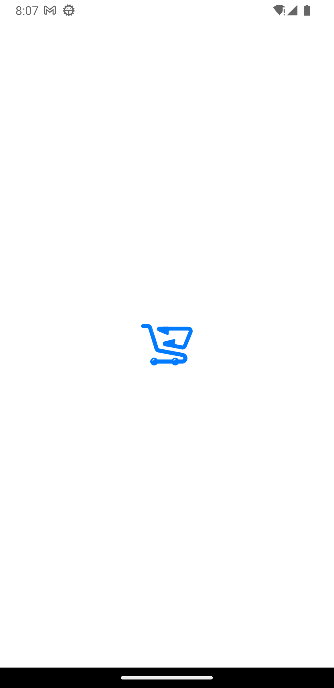
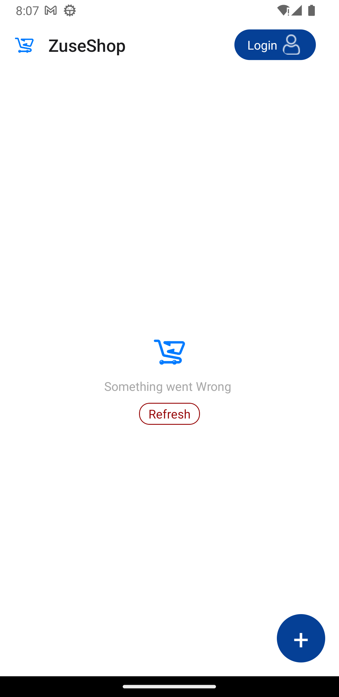
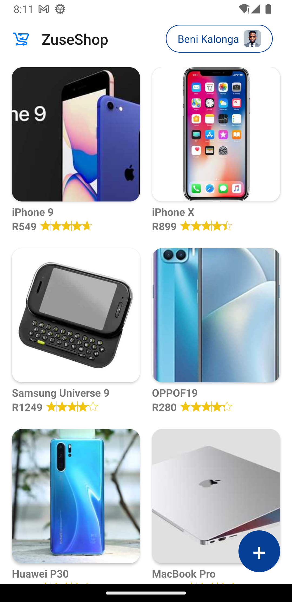
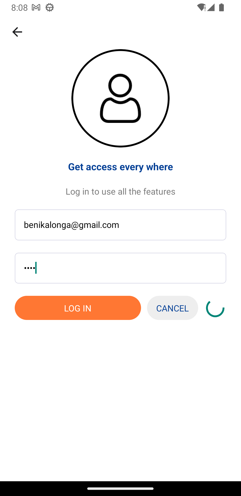
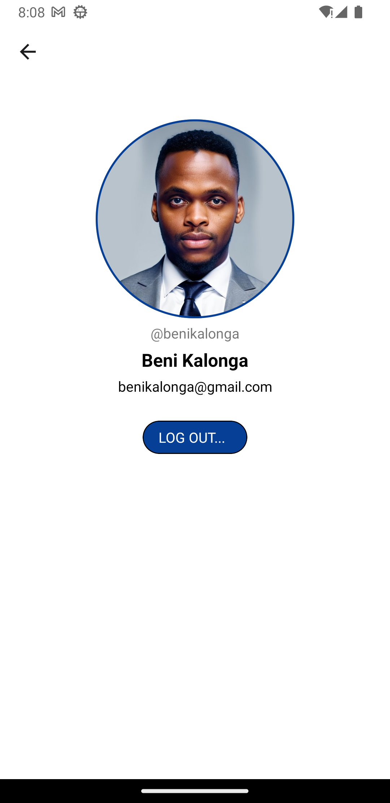
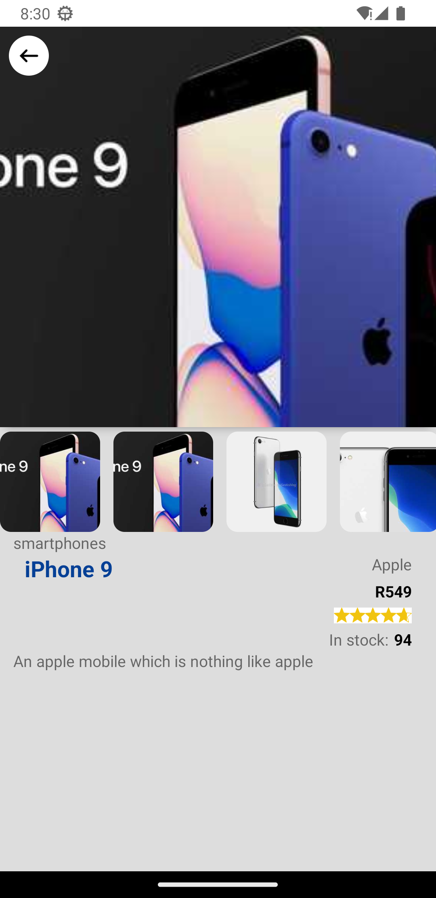
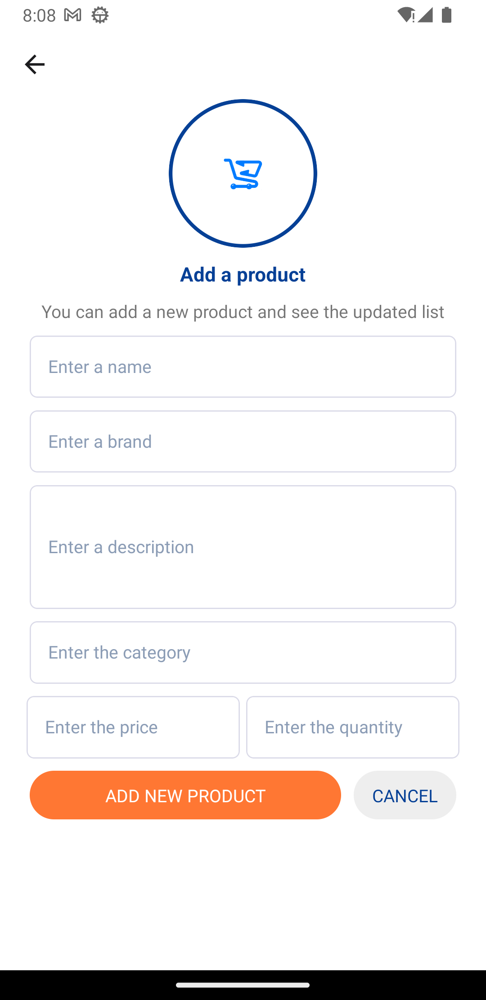
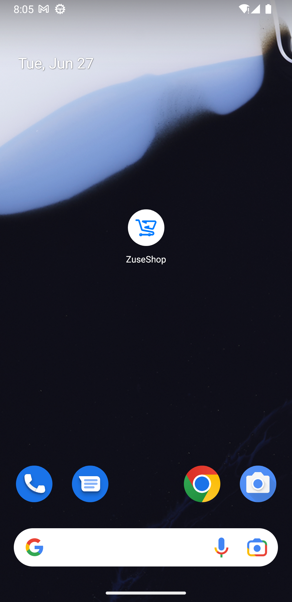

# ZuseShop

## by Beni Kalonga - Technical Assignment

#Get started with this

- To run the project, Clone the app [ZuseShop](https://github.com/benikalonga/ZuseShop.git) 👍
- Open the CMD, and change the directory to the root (e.g CD ''../../ZuseShop'')
- Run the command npm to install all the dependancies
- Run npm start to start the server
- Run npx react-native run-android to run on a android device or npx react-native run-ios to run on a iOS device

### Here is a video showing how it works

# Features

- HomeScreen
- CreationScreen
- ProfileScreen
- LoginScreen
- ProductDetailScreen
- SplashScreen

# Depencies and Libraries

[In the Package.json file](package.json)

- @react-native-async-storage/async-storage": "^1.18.2
- @react-navigation/native": "^6.1.7",
- @react-navigation/native-stack": "^6.9.13",
- @react-navigation/stack": "^6.3.17",
- axios": "^1.4.0",
- react": "18.2.0",
- react-hooks-global-state": "^2.1.0",
- react-native": "0.72.0",
- react-native-gesture-handler": "^2.12.0",
- react-native-ratings": "^8.1.0",
- react-native-safe-area-context": "^4.6.3",
- react-native-screens": "^3.22.0",
- react-native-shared-element": "^0.8.8",
- react-navigation-shared-element": "^3.1.3"

# Architecture (MVC)

## Screenshots (Step by step)

 

  
  
  
  
  
  
  
  
 

